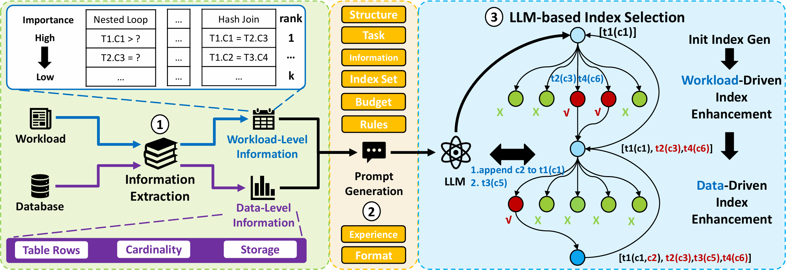

# LLM4IA
Index Advising via Large Language Models


### Code structure
├── config_compare.json　　　　　　　　　　　　　　　# Experimental Configuration File  
├── config_db.json　　　　　　　　　　　　　　　　　 # DB Configuration File  
├── config_LLM.json　　　　　　　　　　　　　　　　　# LLM Configuration File  
├── config_extend.json　　　　　　　　　　　　　　　# Extend Configuration File  
├── config_db2.json　　　　　　　　　　　　　　　　 # DB2 Configuration File  
├── config_relaxtion.json　　　　　　　　　　　　　# Relaxtion Configuration File  
├── README.md　　　　　　　　　　　　　　　　　　   # Code Documentation  
├── requirements.txt　　　　　　　　　　　　　　　  # Experimental Requirements File  
├── LLM4IA_compare.py　　　　　　　　　　　　　　　# Compare Process File  
├── LLM4IA.py　　　　　　　　　　　　　　　　　　　  # LLM4IA Model File  
├── data_process.py　　　　　　　　　　　　　　　　 # Process data                 
├── planTree.py　　　　　　　　　　　　　　　　　　 # Plan Encoding    
├── PostgreSQL.py　　　　　　　　　　　　          # Interact with psql    
├── selection/　　　　　　　　　　　　　　　　　　　 # other IAs　      
├── hypopg/　　　　　　　　　　　　　　　　　　　　  #     
├── tpch-kit/　　　　　　　　　　　　　　　　			    # tpc-h benchmark file  
└── tpch-kit/　　　　　　　　　　　　　　　　			    # tpc-ds benchmark file  
 
### Example workflow

```
python LLM4IA_compare.py					        # Run a experiment
```
